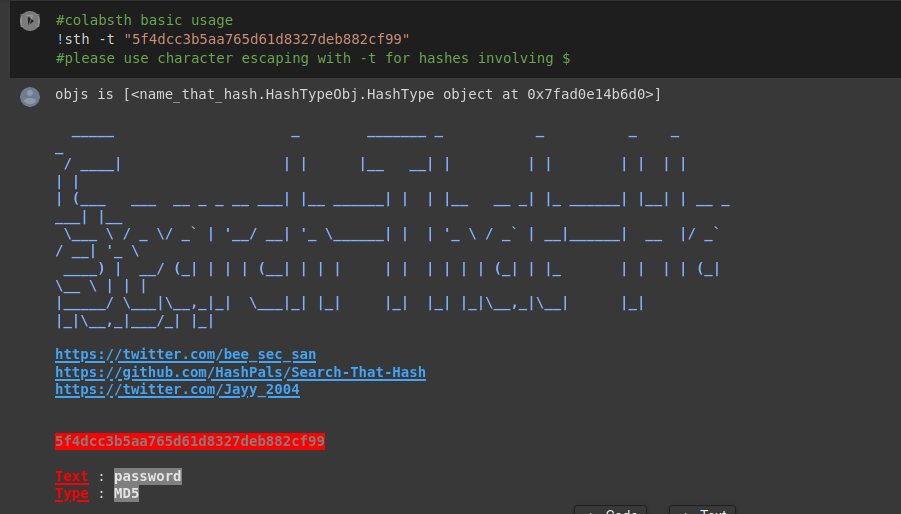

# ➿ColabSTH

### The colab version of [Search-That-Hash](https://github.com/HashPals/Search-That-Hash)

Run [Search-That-Hash](https://github.com/HashPals/Search-That-Hash) from [Google colab](https://colab.research.google.com/) with fast offline(hashcat) mode

## 📖 Usage
- Open the following link which will open copy of **Colabsth.ipynb** in your Google Colab
https://colab.research.google.com/github/vaishnavpardhi/colabsth/blob/main/Colabsth.ipynb
- In Google colab click on **Runtime** tab,then **Change runtime type** and select **Hardware accelerator** to GPU.
- Open your Google Drive and create a directory with name **sth** ,you can put your hash file there.
- Get back to your Google colab,click on **Runtime** tab and select **Run all**.
-  In the first cell,when asked for **authorization code** make sure to click link there,authenticate with your Google account and fill the code.
- The default wordlist **sth** uses is **rockyou.txt** in **offline mode**,but you can upload your custom wordlist in **sth** directory of Google Drive.
- Edit the last cells to pick **sth** mode and run it.

## 💻 Command Usage for ColabSTH
- for help menu
  - `!sth --help`
- for online mode  
  - `!sth -t "5f4dcc3b5aa765d61d8327deb882cf99"`
- for offline(hashcat) mode with **-f**,make sure to upload hash file as **.txt** in your Google Drive **sth directory**
  - `!sth -f /root/.sth/hash.txt -o -w /root/.sth/rockyou.txt`
- for offline(hashcat) mode with **-t**,make sure to use **character escaping** for hashes containing **$**
  - `!sth -t "\$6\$GQXVvW4EuM\$ehD6jWiMsfNorxy5SINsgdlxmAEl3.yif0/c3NqzGLa0P.S7KRDYjycw5bnYkF5ZtB8wQy8KnskuWQS3Yr1wQ0" -o -w /root/.sth/rockyou.txt`

## 🤝 Contributing
Feel free to contribute,Issues and Pull Requests are always welcome.

## 🙏 Credits
Thank you [Bee](https://twitter.com/bee_sec_san) and [Jayy](https://github.com/Jayy001) for making this awesome tool [Search-That-Hash](https://github.com/HashPals/Search-That-Hash) and giving me opportunity to speed up its offline mode via [Google Colab](https://colab.research.google.com/).
Check out their other awesome infosec tools [Name-That-Hash](https://github.com/HashPals/Name-That-Hash) and [Ciphey](https://github.com/ciphey/ciphey).
